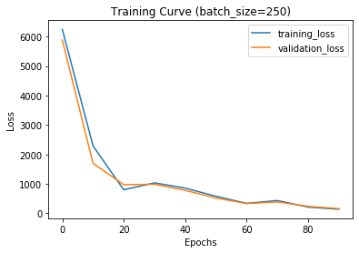
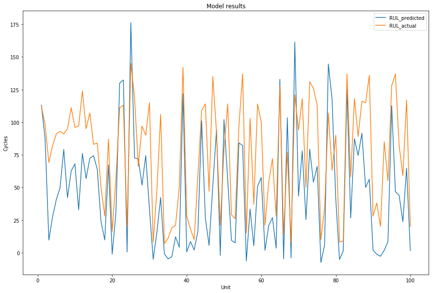
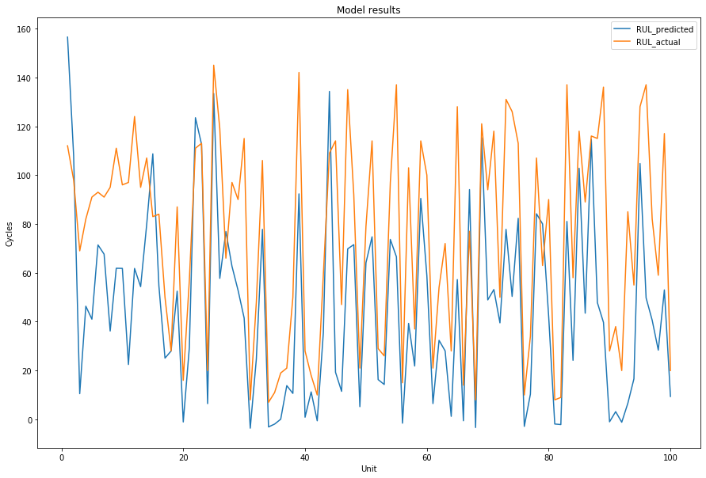

# 09_turbofan_rul
Remaining useful life prediction for turbofan engine data (C-MAPSS)

Remaining Useful Life prediction of Turbo fan engine data (C-MAPSS)
By Sivaji Gudipati

1 Problem statement

Two problems are addressed in this report. Following is a brief description of the problems. 

1.1 Problem 1: “To build a model which should predict the number of remaining operational cycles before failure in the test set, i.e., the number of operational cycles after the last cycle that the engine will continue to operate. Also provided a vector of true Remaining Useful Life (RUL) values for the test data.”
1.2 Problem 2: “To downsample the number of instances (operational cycles) to something like 5 and build another model to predict the RUL.”
2 Model 1
2.1 Data pre-processing
2.1.1 Data: The FD001 dataset is only considered out of the four datasets that are available under C-MAPSS. The .txt files that are present under FD001 and are detailedly explained below.
train_FD001.txt: Contains 20631 data points from 100 different engines. Each datapoint consists of engine id, cycle, 3 operation settings and 21 sensor measurements. I have uploaded this file in my github account so that I can call the link directly. 
test_FD001.txt: Contains 13096 data points and others similar to train_FD001.txt
RUL_FD001.txt: Contains 100 “Remaining Useful Life” values of the test engines. 
2.1.2 Data Cleaning: The .txt files are read as a pandas dataframe. The default column names are assigned as range(len(columns)) by pandas. I have noticed that there are two extra columns generated due to extra white spaces and removed these columns. Since the column names are defaultly given, I have updated the column names to below list for ease of understanding the data.
col_list = ['unit', 'time', 'os_1', 'os_2', 'os_3', 'sm_1', 'sm_2', 'sm_3', 'sm_4', 'sm_5', 'sm_6', 'sm_7', 'sm_8', 'sm_9', 'sm_10', 'sm_11', 'sm_12', 'sm_13', 'sm_14', 'sm_15', 'sm_16', 'sm_17', 'sm_18', 'sm_19', 'sm_20', 'sm_21']
To make sure of no missing values I have printed the info of the dataframe. 
2.1.3 Data Visualization: Plotted the data of the 3 operation settings and 21 sensor measurements to check the trends from healthy state to failure state. 

 
 
Found that few of the categories, there is no significant changing trend from healthy to that of failure phase for around seven features, these features are removed from the dataset that are going to be fed into the model. 
2.1.4 Scaling: The final operation settings and sensor measurements are scaled using minmax scaler from sklearn module. The scaling is necessary for the deep learning model to work. 
2.2 Input preparation
Since, there are only 100 engine ids and making a dataset with only 100 data points may overfit the training data and may not yield an accurate result. I have divided the cycles in each engine id with a number of cycle sequences and used each as an instance for training. In this way I can generate more data points to train on. For explicitly stating, if I choose a seq_length of 30. I stack cycles of 1 to 30 of engine id 1 in sequence, this is one instance. The next is from 2 to 31, and this procedure can be repeated until the failure cycle of each engine. Similarly, the process can be repeated for all the engines.
2.2.1 Sequence length selection: Since the sequence length is limited by the minimum sequence available in the train/test dataset I have selected this value. The value is present in the test data and the sequence length is selected as 31. 
2.2.2 Label dataset preparation: The remaining useful life after every sequence is calculated as number cycles till failure. 
2.3 Model architecture:
The model architecture is as follows, mainly containing two GRUs in series and connected to a linear layer. The batch input of dimension 250 x sequence_length x features is fed to a single layer GRU where the features are converted from 18 to 50. A second GRU in series is connected and hidden dimensions are reduced from 50 to 25. Finally a linear/dense layer is connected to output a single dimension vector.  

 

The model can be further fine tuned for better performance. Due to the time limitation the model is freezed as per the above parameters.
2.3.1 Hyperparameters: Various number of parameters were tweaked manually for better performance of the model. Given the time limitation exploring further options could not become possible. Following are the various hyperparameters that are selected after fine tuning. 

2.3.1.1 Selected hyperparameters

 

2.3.2 Training: Used a one third split of the training data as validation. The data is randomized and sent to the model in batches for training. Used google colab’s GPU capacity for running the model. Following the training curve for the training and validation loss. The training is limited to 100 epochs considering trade off between the time and overfitting. The training and validation loss have followed a decreasing trend which makes clear about the presence of gradient. 

 

2.3.3 Predicting RUL: Once the model is run the weights/parameters that are calculated from the model are saved in the model. These weights are used to predict the remaining useful life from the test data. 
2.3.3.1 Test data preparation: The test data is prepared to feed into the model for the RUL predictions. For this, the sequences of length selected_sequence (31) from the last cycle of each engine are stacked in reverse direction. The process is repeated for all the engine IDs. The test dataset is in the shape 100 x 31 x 18. For the actual labels, the data provided in the RUL.txt file is considered. 
2.3.4 Results: The test data is fed to the model and predictions of remaining useful life were made. The mse loss is noted as 1600 and explanation for high value is explained in the conclusion part. A plot was plotted to compare the actual vs the predicted values. 

 
 
2.4 Conclusion
Following are a few points that are concluded. 
Further fine-tuning of the hyperparameters and exploring various architectures are necessary for enhancing the performance of the model on test set. 
One of the reasons for high loss on test set is because of the less considered sequence length, increasing sequence length to 50 improved the performance, howerer 3 engine IDs don’t have cycles more than 50. 
Dealing with the noise, taking measures to reduce may also help the models performance.
3.0 Model 2
The model 2 is similar to that of model 1 except for the fact that the sequence length is limited to 5. For the initial approach, the same architecture tweaked as that of the model 1. Few hyperparameters are tweaked for better performance. Following are the list of parameters used.
3.1 Model architecture: Played around with few architectures and found the below architecture to be performing little better than others. 

 

3.2 Selected hyperparameters: Following are the hyperparameters chosen for the model2. The training is carried out manually by changing various hyperparameters. 

 

3.3 Predictions: The model yielded a MSE of around 1580 on the test dataset, however this could be further tuned for better results. The actual vs predicted results are as shown.

 

3.4 Conclusion (similar to that of Model 1)
Following are a few points that are concluded. 
Further fine-tuning of the hyperparameters and exploring various architectures are necessary for enhancing the performance of the model on test set. 
Dealing with the noise, taking measures to reduce may also help the model’s performance.
